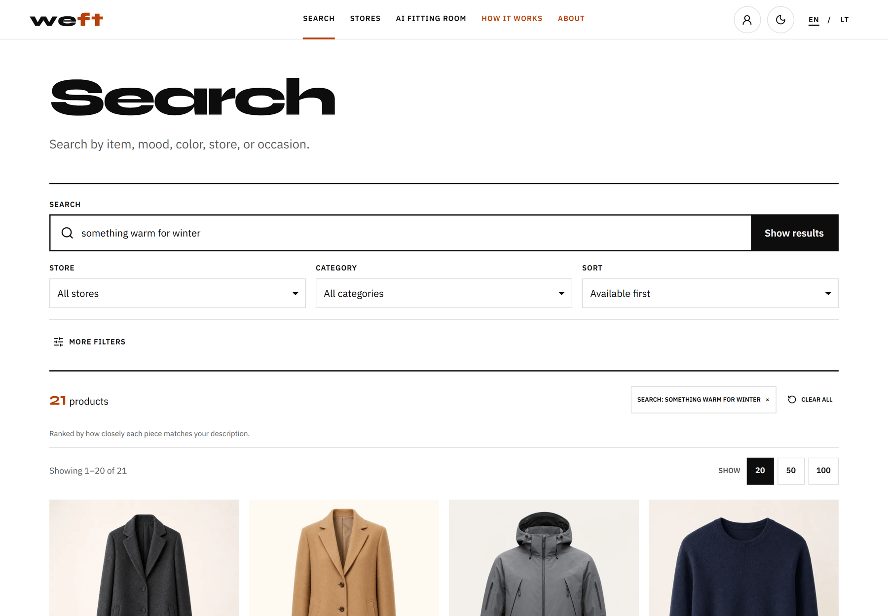
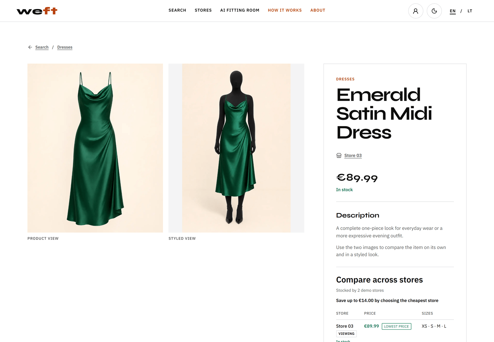
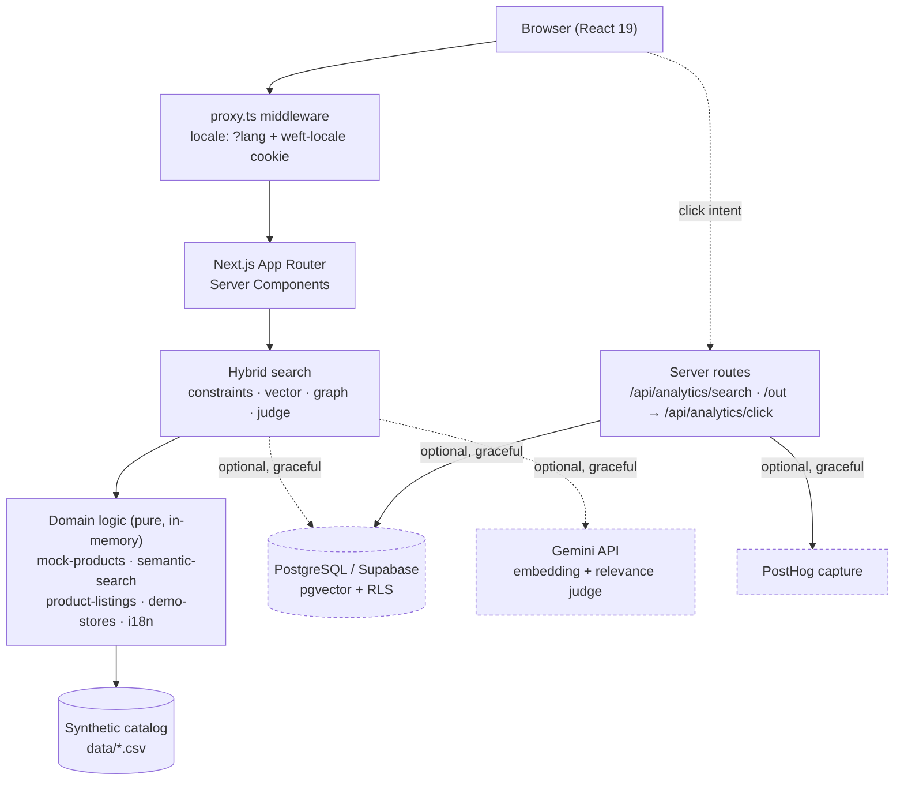

# Weft

**A bilingual fashion discovery and search platform, built end-to-end as a full-stack MVP.**
Next.js (App Router) · TypeScript · an explainable concept-graph search engine · Supabase/PostgreSQL analytics · EN/LT localization · Playwright regression suite · Vercel.

**[▶ Live demo](https://fashion-aggregator-flame.vercel.app)** — no login, runs entirely on the synthetic catalog.

[](https://fashion-aggregator-flame.vercel.app/search?query=something%20warm%20for%20winter)

<sub>*"something warm for winter"* — the concept graph reaches coats, a technical parka and a merino knit from a query that matches no product's literal text.</sub>

> Weft is a **synthetic demo product**. It serves a hand-built catalog of fictional
> items — there is no live retailer data, no checkout, and no real merchant links.
> That boundary is enforced in code, not just documented (see [Demo-data boundary](#demo-data-boundary)).

---

## Overview

Fashion shoppers rarely search the way catalogs are indexed. They think in moods,
occasions, and half-remembered details — *"something for a rainy hike"*, *"office
but not stuffy"* — not in SKUs or exact category names. Weft is a discovery layer
that meets that: a shopper types intent in English or Lithuanian, and the app
ranks a catalog by meaning, filters by real facets, and compares the same item
across stores.

It is built as a realistic pre-affiliate MVP — the stage before a fashion
aggregator has signed retailer feeds. Everything a live version would need
(search, ranking, product/detail/compare flows, click-intent analytics, a
localized UI, a hardened schema) is implemented against a **synthetic catalog**,
so the product is fully explorable without a single real merchant integration.



<sub>Product detail and the synthetic cross-store price comparison — stores are neutral `Store NN` public identities, never real retailer names (see [Demo-data boundary](#demo-data-boundary)).</sub>

## What it demonstrates

Ownership across the whole stack, not one slice of it:

- **Frontend** — Next.js App Router with React Server Components, a responsive
  product/search/detail/account experience, light/dark theming, and WCAG-oriented markup.
- **Backend / API** — server routes for click-intent and search analytics with
  same-origin validation and non-blocking capture.
- **Data** — an incremental PostgreSQL schema with row-level security, plus a
  hand-parsed CSV catalog layer that needs no database to run.
- **Search** — Gemini Embedding 2 retrieval in Supabase/pgvector, concept-graph
  fusion, and a schema-constrained Gemini 3.6 Flash relevance judge, with a
  deterministic local fallback and leakage-resistant evaluation harness.
- **Internationalization** — EN/LT with query + cookie precedence, middleware,
  and a browser regression suite that proves it stays consistent.
- **Deployment** — Vercel, with locale middleware and graceful degradation when
  optional services are absent.
- **AI-assisted engineering** — a structured Claude Code / Codex workflow
  captured in a hierarchical `AGENTS.md` tree and `CLAUDE.md`, used with tests
  and human-directed decisions rather than as a code generator.

## Engineering approach

This project follows the same engineering principles I use across software and AI-assisted development: ground truth over assumptions, root cause over local patches, measurable changes, adversarial verification, bounded failure modes, and explainable decisions.

**[Read my Engineering Principles →](https://github.com/Yashelly/Yashelly/blob/main/ENGINEERING_PRINCIPLES.md)**

## Architecture



The base catalog is read and joined **in memory from CSV at request time** — the
app has no hard database dependency. Supabase/PostgreSQL, Gemini, and PostHog are
**optional**: search falls back locally and analytics paths no-op cleanly when
their environment variables are unset, so the whole product runs from a clean
clone with zero credentials.

## Key engineering work

**1. Explainable hybrid search — cloud retrieval with a deterministic fallback.**
`lib/semantic-search.ts` converts noisy free text into a reviewable query plan:
garment, colour, direct attributes, department, exclusions, price range, and
availability remain hard constraints while style/occasion intent is expanded
through a weighted concept graph. Exact matches and explicitly labelled
alternatives are separate, so a near-miss cannot silently violate colour or
budget or inflate evaluation. When configured, `lib/hybrid-search.ts` combines
Gemini Embedding 2 retrieval from Supabase/pgvector with that concept-graph lane
using reciprocal-rank fusion, then asks a schema-constrained Gemini 3.6 Flash
judge to return only strong matches from the top 40 candidates. When a cloud
dependency is absent, invalid, quota-limited, or times out, the demo falls back
to the local engine instead of failing the request. The
provider bake-off is documented in
[`docs/cloud-search-bakeoff.md`](docs/cloud-search-bakeoff.md)
under this same constraint/explanation layer.

**2. A leakage-resistant search-evaluation harness.**
Routine CI scores a 44-case DEV set and a 48-case inspected REGRESSION set. The
current production candidate was frozen before a new 200-case final blind v3
was structurally reviewed and SHA-256 sealed. Its one authorised first run scored
**195/200 (97.5%)**; the report and all production/evaluator fingerprints are now
immutable. The harness reports hit@5, precision@5, recall, reciprocal rank,
stable failed IDs, expected versus actual rankings, candidate positions,
required/forbidden windows, and category/difficulty/language breakdowns.

**3. A demo-data boundary enforced in code.**
Public store identity is decoupled from internal retailer identity: internal
slugs map to six neutral public IDs (`demo-store-01…06`) in `lib/demo-stores.ts`.
Active tracked retailers map via a stable hash; the current synthetic catalog
(every row uses the `vibewear_demo` demo source) is distributed across the six
stores by product id. Only synthetic rows (`source_status === "mock_not_live"`)
whose store slug is an **active retailer or an approved synthetic source** ever
render — products attached to a **suspended or unknown** store are rejected at the
product boundary, not silently reassigned. `/out/:productId` **never** redirects
to a merchant — it renders an on-site synthetic-preview guard and posts a
click-intent event. The boundary is a hard rule the code upholds, so the demo
can't accidentally imply real partnerships.

**4. Same-origin, non-blocking analytics endpoints.**
`POST /api/analytics/click` requires a same-origin `Origin` header
(`lib/request-security.ts` — a missing `Origin` is rejected, and `X-Forwarded-Host`
is not trusted; set `APP_CANONICAL_ORIGIN` for a strict production check),
validates the product ID, reads correlation only from **HttpOnly** cookies,
schedules bounded best-effort server-side capture, and returns `202`. The `202`
means the request was *accepted*, not that either sink persisted it — `after()`
runs post-response, so the per-sink outcome (`supabase=… posthog=…`) is emitted to
the server log, not the HTTP status. Both routes are a genuine no-op (no persist,
no identifier cookie) when **no** sink is configured — i.e. neither
`POSTHOG_PROJECT_API_KEY` nor Supabase env is set. (Consent-based gating of an
*enabled* pipeline is a documented follow-up, not yet wired.)

**5. Localization that's proven, not assumed.**
EN/LT is selected by a canonical `?lang` param with a `weft-locale` cookie
fallback, resolved in middleware, with all copy centralized in `lib/i18n.ts` and
a `withLocale()` helper that keeps every internal link locale-stable. A Playwright
suite (`scripts/locale_e2e.py`) exercises cookie/query precedence, every public
route, internal links, search filters, mobile/desktop layouts, browser history,
and `/out` success/404 across both locales.

**6. Feed-oriented PostgreSQL schema with RLS.**
Four incremental migrations (`sql/00N_*.sql`) model the pre-affiliate schema and
the synthetic-click analytics boundary: a feed-import lifecycle
(`feed_import_runs` + `raw_feed_items` with jsonb payloads and validation state),
content-hash columns, variants, per-relationship `on delete` rules, and FK/GIN
indexes chosen for real query patterns. **The lifecycle's auditability and
hash-based idempotency are schema *intent*, not enforced guarantees** — there is
no feed importer yet, and `status`/counters/hashes are unconstrained metadata (see
`docs/data-model.md` and `sql/AGENTS.md`). Private domain and analytics tables
remain `service_role`-only. Migration 004 exposes only public search documents
and a read-only `security invoker` RPC to `anon`/`authenticated`; RLS restricts
those rows to `is_public`. Migrations are applied manually in numeric order (no
runner). The full ER diagram and rationale are in
[`docs/data-model.md`](docs/data-model.md).

## Search relevance and evaluation

Run `npm run test:search` for development gates, `npm run eval:consumed` for the
inspected regression extension, `npm run eval:historical:v2` for the old-engine
record, or `npm run eval:blind` to verify and display the immutable v3 first run.
Current results against the 64-item synthetic catalog:

| Set | Queries | Passing | Diagnostic precision | Recall | What the number is worth |
|-----|--------:|--------:|---------------------:|-------:|--------------------------|
| **Final blind v3** — sealed before first run | 200 | **195/200 (97.5%)** | **0.958 p@5** | **0.934** | The public first-run validation metric for the frozen hybrid architecture; immutable report and fingerprints. |
| **Dev** — tuning allowed | 44 | 44/44 (100%) | 0.941 | 0.973 | A **fit ceiling**, not generalization: the graph was shaped to answer these. High here only proves the graph *can express* the answers. |
| **Regression** — previously inspected | 48 | 47/48 (97.9%) | 0.985 | 1.000 | A **benchmark, not an unseen signal**. Its job is to be a tripwire when the graph changes. |
| **Consumed final blind v2** — frozen 2026-09-08 | 200 | **105/200 (52.5%)** | **0.558** | **0.726** | Immutable old-engine first run. Its inspected failures later informed the cloud architecture, so it is no longer a public unseen metric. |
| **Historical blind** — already published | 18 | Historical only | — | — | Preserved as an immutable audit trail; its result is known and is not the final metric. |
| **Consumed former final blind** — 2026-09-07 | 200 | Historical first run: 60/200 (30.0%) | 0.366 | 0.499 | Its output is now used for regression tuning; not an independent metric. |

The retrieval candidate (`gemini-embedding-2` + structured prefilters + concept
graph + RRF) passed **91/92 known DEV/REGRESSION cases (98.9%)** during model
selection. The frozen Gemini 3.6 Flash judge then reached **196/200 (98.0%)** on
consumed v2 under the final pass contract. Both are inspected development
evidence, not the public blind metric.

Final blind v2 was authored from catalog evidence in a clean-room agent context,
then rejected twice and corrected during a separate catalog-only review. The
case set, catalog, engine, evaluator, validator, loader, and CSV parser were
sealed before the first run. This is AI-assisted labelling over a synthetic
catalog—not an independent human study—and the result is deliberately reported
despite missing the desired 97–99% target. Its weakest categories are
ambiguous/conceptual (15%) and price/value (25%); colour constraints are strongest
at 85%. Full per-case diagnostics are committed in
[`reports/search/final-blind-v2-report.json`](reports/search/final-blind-v2-report.json).

The original held-out set and both earlier 18-case blind generations have already
been inspected or published. They remain useful regression/history artifacts,
but calling them sealed today would be false. The 200 former-final cases were
authored from catalog evidence without running the ranker, passed structural
duplicate and schema checks, and were frozen by SHA-256 before scoring. Their
first-run report remains immutable, but they are now consciously used for tuning.

V2 is explicitly reclassified as consumed. Final blind v3 contains 200 new cases
(20 per category; 60 easy, 80 medium, 60 adversarial; 180 EN and 20 LT), was
checked against every earlier set for duplicates and near-duplicates, and was
sealed before any retrieval or judge output was inspected. Its first run on
2026-09-10 passed **195/200 (97.5%)**. Five failures remain in the immutable raw
result (`FB3-045`, `FB3-149`, `FB3-158`, `FB3-179`, `FB3-194`); the report also
records two clear annotation defects and one debatable ontology label rather
than silently rescoring them. This is AI-assisted evaluation over a synthetic
64-product catalog, not human-labelled live-search evidence.
The full protocol, anti-leakage rules, category table, and immutable report live in
[`docs/search-evaluation.md`](docs/search-evaluation.md).

## Technology

| Layer | Choice |
|-------|--------|
| Framework | Next.js 16 (App Router, React Server Components) |
| Language | TypeScript (strict), React 19 |
| Search | Gemini Embedding 2 + Supabase pgvector + structured prefilters + concept graph/RRF + Gemini 3.6 Flash relevance judge; local fallback |
| Data (base catalog) | Hand-parsed CSV, read in memory at request time |
| Persistence / analytics | Supabase + PostgreSQL, PostHog — both optional |
| 3D prototype | Three.js (fitting-room mannequin) |
| Testing | Node eval harness (search), Python Playwright (locale/browser E2E) |
| Deployment | Vercel, with `proxy.ts` locale middleware |

## Project structure

```
app/            App Router pages (server components) + analytics API routes
components/     React UI: search, product grid/detail, account, fitting room
lib/            Domain logic — semantic-search, mock-products, i18n,
                demo-stores, product-listings, analytics, supabase clients
data/           Synthetic catalog + store tracker (CSV)
sql/            Incremental PostgreSQL migrations (RLS-hardened)
scripts/        Search eval harness + Playwright locale suite + data gen
docs/           Product/UX audits, data-workflow and feed-format research
proxy.ts        Locale middleware
```

## Running locally

```bash
npm install
npm run build && npm run start   # production preview at http://localhost:3000
```

No environment variables are required — the app falls back to the deterministic
engine over the synthetic catalog. To enable hybrid search, copy `.env.example`
to `.env.local`, fill the Gemini and Supabase values, run
`npm run search:migrate`, then `npm run search:index`, and verify with
`npm run search:doctor`. The doctor prints presence/readiness only, never keys.

Production index refreshes are automated by
`.github/workflows/search-index.yml`. It runs after catalog/search-document
changes reach `main` and can also be started manually. Configure the repository
secret `GEMINI_API_KEY` plus either `SUPABASE_URL` and a dedicated Supabase
`SUPABASE_SECRET_KEY` (preferred), or `SUPABASE_DB_URL`. Privileged credentials
are server-only and must never be added to Vercel client variables or source
control. Direct Postgres remains an indexing fallback, not a production runtime
dependency.

## Validation

```bash
npm run typecheck        # tsc --noEmit
npm run test:unit        # search-engine invariants (node:test)
npm run test:search      # semantic-search relevance eval (no server needed)
npm run build            # next build

# full-stack HTTP smoke: search render + /out guard + click-endpoint security
npm run build && npm run test:integration

# locale/browser regression (needs the app running + Python Playwright)
BASE_URL=http://127.0.0.1:3000 npm run test:locale
```

`test:integration` boots the production server and asserts the frontend/backend
boundary: a search renders real results, `/out/:id` guards valid ids and 404s
unknown ones, and `POST /api/analytics/click` returns `202` same-origin but `403`
cross-origin, `404` for an unknown product, and `413` for an oversized body. It's
run before merging, not in the required CI gates (it needs a build and a live
port).

## Current limitations

These are intentional for a pre-affiliate MVP and are called out honestly:

- **Synthetic catalog only.** All products are fictional; there is no live
  retailer data and no checkout.
- **No live feeds connected.** Real products/links require an approved affiliate
  feed plus destination validation — `/out` is a guard, not a redirect.
- **The fitting room is a client-side 3D prototype, not image-based AI try-on.**
  Body measurements shape a Three.js mannequin, an optional photo is used only to
  approximate skin tone and **never leaves the device**, and the result is a
  rotatable, deliberately approximate garment preview. There is no image model,
  no generation call, and no server round-trip — photorealistic image-based
  try-on is on the roadmap, not built. The Three.js bundle is code-split
  (`dynamic(… ssr:false)`) so it never loads on other routes, and when WebGL is
  unavailable or the GPU context is lost it degrades to a labelled fallback that
  still shows the applied measurements — never a dead black canvas.

  
- **Supabase and PostHog are optional.** Analytics and persistence degrade to
  no-ops without credentials; the product is fully usable without them.

## Roadmap

Tracked in [`ROADMAP.md`](ROADMAP.md). Near-term technical direction:

1. Connect a first real affiliate feed behind the existing `/out` validation gate.
2. Move the base catalog from CSV to PostgreSQL once a feed exists.
3. Wire the fitting-room prototype to an image-generation backend.
4. Improve the ranker using DEV/REGRESSION only; when ready, retire the current
   final set and commission a new independently labelled blind set or use real
   click judgements.

---

Built with a disciplined AI-assisted workflow (Claude Code / Codex) — see
[`CLAUDE.md`](CLAUDE.md) and the hierarchical [`AGENTS.md`](AGENTS.md) tree for
how that work is structured. Commits are co-authored where AI assistance was used.
