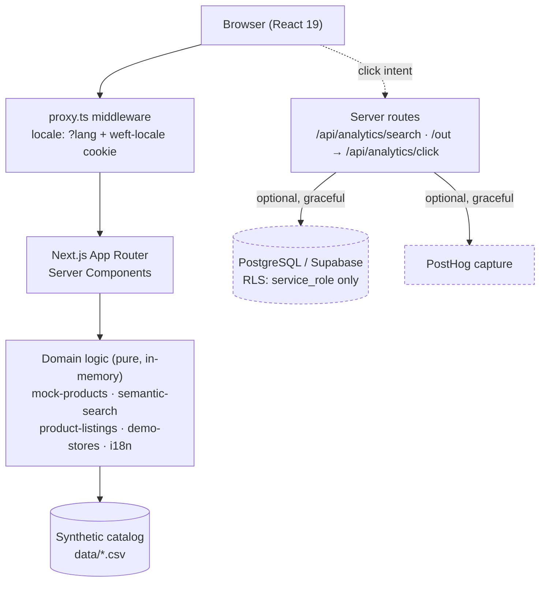

# Weft

**A bilingual fashion discovery and search platform, built end-to-end as a full-stack MVP.**
Next.js (App Router) · TypeScript · an explainable concept-graph search engine · Supabase/PostgreSQL analytics · EN/LT localization · Playwright regression suite · Vercel.

> Weft is a **synthetic demo product**. It serves a hand-built catalog of fictional
> items — there is no live retailer data, no checkout, and no real merchant links.
> That boundary is enforced in code, not just documented (see [Demo-data boundary](#demo-data-boundary)).

---

## Overview

Fashion shoppers rarely search the way catalogs are indexed. They think in moods,
occasions, and half-remembered details — *"something for a rainy hike"*, *"office
but not stuffy"* — not in SKUs or exact category names. Weft is a discovery layer
that meets that: a shopper types intent in English or Lithuanian, and the app
ranks a catalog by meaning, filters by real facets, and compares the same item
across stores.

It is built as a realistic pre-affiliate MVP — the stage before a fashion
aggregator has signed retailer feeds. Everything a live version would need
(search, ranking, product/detail/compare flows, click-intent analytics, a
localized UI, a hardened schema) is implemented against a **synthetic catalog**,
so the product is fully explorable without a single real merchant integration.

## What it demonstrates

Ownership across the whole stack, not one slice of it:

- **Frontend** — Next.js App Router with React Server Components, a responsive
  product/search/detail/account experience, light/dark theming, and WCAG-oriented markup.
- **Backend / API** — server routes for click-intent and search analytics with
  same-origin validation and non-blocking capture.
- **Data** — an incremental PostgreSQL schema with row-level security, plus a
  hand-parsed CSV catalog layer that needs no database to run.
- **Search** — a deterministic, explainable concept-graph ranker with its own
  evaluation harness (dev vs. sealed held-out sets).
- **Internationalization** — EN/LT with query + cookie precedence, middleware,
  and a browser regression suite that proves it stays consistent.
- **Deployment** — Vercel, with locale middleware and graceful degradation when
  optional services are absent.
- **AI-assisted engineering** — a structured Claude Code / Codex workflow
  captured in a hierarchical `AGENTS.md` tree and `CLAUDE.md`, used with tests
  and human-directed decisions rather than as a code generator.

## Architecture



The base catalog is read and joined **in memory from CSV at request time** — the
app has no hard database dependency. Supabase/PostgreSQL and PostHog are
**optional**: every analytics path no-ops cleanly when their environment
variables are unset, so the whole product runs from a clean clone with zero
credentials.

## Key engineering work

**1. Explainable concept-graph search — no embeddings, no model, no API keys.**
`lib/semantic-search.ts` ranks by meaning using a weighted bilingual concept
graph, not token matching and not an embedding model. A query is canonicalized
against an EN/LT lexicon, expanded two hops into the catalog's own vocabulary,
and each concept is satisfied by its single best match on a product (never
summed — otherwise broad concepts would penalize themselves). Terms that name a
*kind of thing* additionally constrain the result set, so *"shoes for hiking in
the rain"* can't answer with a parka. Every ranking decision is inspectable,
which is the reason it can be evaluated rather than eyeballed.

**2. A search-evaluation harness with an honest three-way split.**
`scripts/semantic-eval.mjs` scores 92 hand-labelled queries across three sets
with three different levels of trust: a **dev set** tuning may touch (a fit
ceiling, not a generalization estimate), a **regression set** that was once
held-out but has since been inspected and so is now a benchmark rather than an
unbiased signal, and a **blind set** sealed and scored exactly once. It reports
precision@k (`k = min(5, |relevant|)`, so narrow queries aren't unfairly capped),
recall, and a per-query pass/fail, and includes *negative* queries (the catalog
doesn't stock the thing, so the win is resisting a made-up answer) and `mustRank`
constraints. Why this split, and why 26/30 is *not* "unseen", is spelled out in
[Search relevance and evaluation](#search-relevance-and-evaluation).

**3. A demo-data boundary enforced in code.**
Public store identity is decoupled from internal retailer identity: internal
slugs map to six neutral public IDs (`demo-store-01…06`) via a stable hash
(`lib/demo-stores.ts`), and only synthetic rows (`source_status ===
"mock_not_live"`) ever render. `/out/:productId` **never** redirects to a
merchant — it renders an on-site synthetic-preview guard and posts a click-intent
event. The boundary is a hard rule the code upholds, so the demo can't
accidentally imply real partnerships.

**4. Hardened, non-blocking analytics endpoints.**
`POST /api/analytics/click` validates the request is same-origin
(`lib/request-security.ts`), validates the product ID, reads correlation only
from **HttpOnly** cookies, schedules bounded server-side capture, and returns
`202` without delaying navigation. Both analytics routes degrade to a "disabled"
no-op when PostHog isn't configured.

**5. Localization that's proven, not assumed.**
EN/LT is selected by a canonical `?lang` param with a `weft-locale` cookie
fallback, resolved in middleware, with all copy centralized in `lib/i18n.ts` and
a `withLocale()` helper that keeps every internal link locale-stable. A Playwright
suite (`scripts/locale_e2e.py`) exercises cookie/query precedence, every public
route, internal links, search filters, mobile/desktop layouts, browser history,
and `/out` success/404 across both locales.

**6. Feed-oriented PostgreSQL schema with RLS.**
Three incremental migrations (`sql/00N_*.sql`) model the pre-affiliate schema and
the synthetic-click analytics boundary: an auditable feed-import lifecycle
(`feed_import_runs` + `raw_feed_items` with jsonb payloads and validation state),
content-hash change detection, variants, per-relationship `on delete` rules, and
FK/GIN indexes chosen for real query patterns. Row-level security grants access
only to `service_role`, blocking `anon`/`authenticated` entirely. The full ER
diagram and rationale are in [`docs/data-model.md`](docs/data-model.md).

## Search relevance and evaluation

Run `npm run test:search`. Current measured results against the 64-item synthetic
catalog (`k = min(5, |relevant|)`; passing bar ≥ 80% of queries per set at
precision@k ≥ 0.6):

| Set | Queries | Passing | Mean p@k | Recall | What the number is worth |
|-----|--------:|--------:|---------:|-------:|--------------------------|
| **Dev** — tuning allowed | 44 | 44/44 (100%) | 0.941 | 0.981 | A **fit ceiling**, not generalization: the graph was shaped to answer these. High here only proves the graph *can express* the answers. |
| **Regression** — previously inspected | 30 | 26/30 (86.7%) | 0.926 | 1.000 | A **benchmark, not an unseen signal** (see below). Its job is to be a tripwire that must not drop when an edge is retuned. |
| **Blind** — sealed 2026-08-15, scored once | 18 | 17/18 (94.4%) | 0.944 | 1.000 | The **current best generalization estimate**. Reported, deliberately *not* a CI gate. |

**Why the regression set is not "unseen", and why that's stated plainly.** It was
written before tuning and scored blind exactly once — **24/30**. Its four failures
were then inspected, and two exposed two real defects: the word *tracksuit* was
missing from the lexicon entirely, and a `jewelry → accessories` edge let every
belt and sock answer *"earrings"*. Fixing those took the same set to **26/30**.
That second number is a useful regression benchmark, but it is **no longer an
unbiased estimate of unseen-query performance** — the set has been looked at.
Calling it "sealed / unseen" today would be false, so the repo doesn't.

**The blind set is the replacement, and it is only scored once.** Neither the
engine nor a single label may be changed in response to how the blind set scores;
the first time a weight is nudged to lift it, it is burned and becomes a second
regression set. On its one sealed run it passed **17/18** and — usefully —
immediately caught a real limitation the tuned sets did not: `"yellow dress"`
should answer *"not stocked"* (there is nothing yellow in the catalog) but returns
four non-yellow dresses, because an **unknown** colour token doesn't constrain the
result the way a *known* one does (`"beige coat"`, with *beige* in the lexicon,
correctly returns nothing). That failure is reported, not patched — patching it
would defeat the purpose of a blind set. It's logged in
[`docs/search-engine.md`](docs/search-engine.md#known-limitations).

The full methodology, and the split's rationale, lives in
[`docs/search-engine.md`](docs/search-engine.md).

## Technology

| Layer | Choice |
|-------|--------|
| Framework | Next.js 16 (App Router, React Server Components) |
| Language | TypeScript (strict), React 19 |
| Search | Custom concept-graph ranker (`lib/semantic-search.ts`), no external model |
| Data (base catalog) | Hand-parsed CSV, read in memory at request time |
| Persistence / analytics | Supabase + PostgreSQL, PostHog — both optional |
| 3D prototype | Three.js (fitting-room mannequin) |
| Testing | Node eval harness (search), Python Playwright (locale/browser E2E) |
| Deployment | Vercel, with `proxy.ts` locale middleware |

## Project structure

```
app/            App Router pages (server components) + analytics API routes
components/     React UI: search, product grid/detail, account, fitting room
lib/            Domain logic — semantic-search, mock-products, i18n,
                demo-stores, product-listings, analytics, supabase clients
data/           Synthetic catalog + store tracker (CSV)
sql/            Incremental PostgreSQL migrations (RLS-hardened)
scripts/        Search eval harness + Playwright locale suite + data gen
docs/           Product/UX audits, data-workflow and feed-format research
proxy.ts        Locale middleware
```

## Running locally

```bash
npm install
npm run build && npm run start   # production preview at http://localhost:3000
```

No environment variables are required — the app runs fully on the synthetic
catalog. To enable analytics/persistence, copy `.env.example` to `.env.local`
and fill in the optional Supabase/PostHog values.

## Validation

```bash
npm run typecheck        # tsc --noEmit
npm run test:unit        # search-engine invariants (node:test)
npm run test:search      # semantic-search relevance eval (no server needed)
npm run build            # next build

# full-stack HTTP smoke: search render + /out guard + click-endpoint security
npm run build && npm run test:integration

# locale/browser regression (needs the app running + Python Playwright)
BASE_URL=http://127.0.0.1:3000 npm run test:locale
```

`test:integration` boots the production server and asserts the frontend/backend
boundary: a search renders real results, `/out/:id` guards valid ids and 404s
unknown ones, and `POST /api/analytics/click` returns `202` same-origin but `403`
cross-origin, `404` for an unknown product, and `413` for an oversized body. It's
run before merging, not in the required CI gates (it needs a build and a live
port).

## Current limitations

These are intentional for a pre-affiliate MVP and are called out honestly:

- **Synthetic catalog only.** All products are fictional; there is no live
  retailer data and no checkout.
- **No live feeds connected.** Real products/links require an approved affiliate
  feed plus destination validation — `/out` is a guard, not a redirect.
- **The fitting room is a client-side 3D prototype, not image-based AI try-on.**
  Body measurements shape a Three.js mannequin, an optional photo is used only to
  approximate skin tone and **never leaves the device**, and the result is a
  rotatable, deliberately approximate garment preview. There is no image model,
  no generation call, and no server round-trip — photorealistic image-based
  try-on is on the roadmap, not built. The Three.js bundle is code-split
  (`dynamic(… ssr:false)`) so it never loads on other routes, and when WebGL is
  unavailable or the GPU context is lost it degrades to a labelled fallback that
  still shows the applied measurements — never a dead black canvas.
- **Supabase and PostHog are optional.** Analytics and persistence degrade to
  no-ops without credentials; the product is fully usable without them.

## Roadmap

Tracked in [`ROADMAP.md`](ROADMAP.md). Near-term technical direction:

1. Connect a first real affiliate feed behind the existing `/out` validation gate.
2. Move the base catalog from CSV to PostgreSQL once a feed exists.
3. Wire the fitting-room prototype to an image-generation backend.
4. Broaden the search lexicon and grow the blind evaluation set — ideally
   labelled by someone other than the engine's author, or from real click data.

---

Built with a disciplined AI-assisted workflow (Claude Code / Codex) — see
[`CLAUDE.md`](CLAUDE.md) and the hierarchical [`AGENTS.md`](AGENTS.md) tree for
how that work is structured. Commits are co-authored where AI assistance was used.
