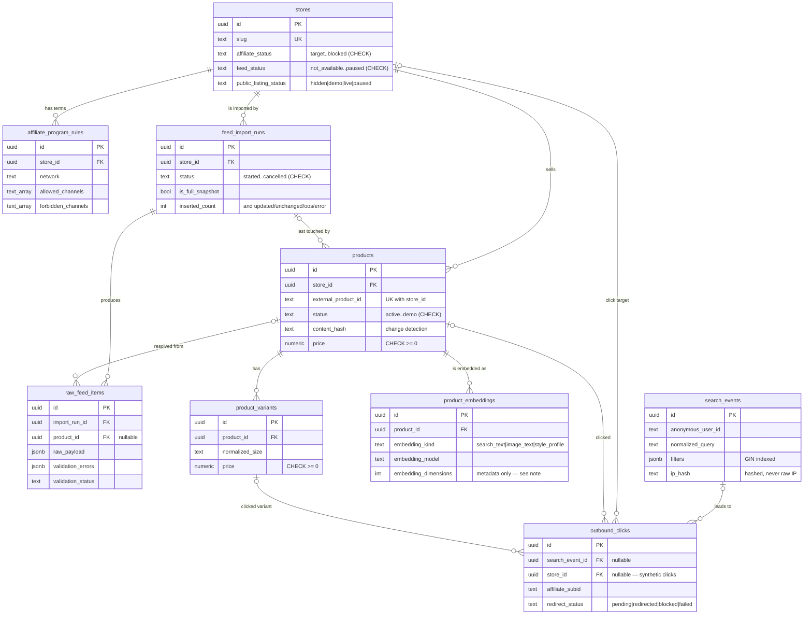

<!-- Parent: ../CLAUDE.md -->

# Data model

The PostgreSQL schema (`sql/00N_*.sql`, applied in numeric order — there is no
migration runner wired up) models the stage **before** a fashion aggregator has
signed retailer feeds: it is built to receive real affiliate feeds, but the live
app never reads from it. The base catalog is the synthetic CSV
(`data/mock_products.csv`); this database exists so the ingestion, catalog, and
analytics boundaries are designed *before* real data arrives, not retrofitted
after. Supabase is optional — the product runs with no database at all.

Three domains: **catalog** (what is for sale), **ingestion** (how a feed becomes
catalog rows, with a full audit trail), and **analytics** (what shoppers did).



## Why it's shaped this way

**The feed lifecycle is auditable, not a black box.** A `feed_import_runs` row is
opened per import with a `status` machine (`started → downloaded → parsed →
completed`/`failed`/`cancelled`) and per-run counters (`inserted_count`,
`updated_count`, `unchanged_count`, `out_of_stock_count`, `error_count`). Every
input row is preserved in `raw_feed_items` with its `raw_payload` (jsonb), its
`normalized_payload`, and a `validation_status` + `validation_errors` — so a bad
import can be explained and replayed rather than guessed at. `products.content_hash`
/ `raw_hash` make re-imports idempotent: unchanged rows are detected and skipped,
which is what the counters above measure.

**On-delete behavior is chosen per relationship, not defaulted.**

- *Owned children cascade.* Deleting a store removes its `products`,
  `feed_import_runs`, `raw_feed_items`, and rules — they cannot exist without it.
  A product's `product_variants` and `product_embeddings` cascade likewise.
- *Analytics references null out.* `outbound_clicks.product_id`,
  `variant_id`, and `search_event_id` are `on delete set null`, and
  `products.last_import_run_id` is too — history must survive the deletion of the
  thing it once pointed at. A click that happened is a fact; losing the product
  later must not erase it.
- *Click store is `restrict`.* `outbound_clicks.store_id` is `on delete restrict`:
  you cannot delete a store out from under its recorded clicks. It is also
  **nullable** (migration `003`) precisely because a *blocked synthetic-preview*
  click has no real merchant — the column becomes required only once an approved
  live redirect is being recorded (see the column comment).

**Indexes match real query patterns, not every column.** FKs used for lookups are
indexed (`affiliate_program_rules.store_id`, `raw_feed_items.import_run_id/store_id/product_id`,
`product_variants.product_id`, `product_embeddings.product_id`, and the four
`outbound_clicks` FKs). Time-series reads are covered by `desc` composite indexes
(`feed_import_runs(store_id, started_at desc)`, `outbound_clicks(store_id,
clicked_at desc)`). Catalog browse/filter patterns get `products(store_id,
status)`, `products(normalized_category, brand)`, and `products(currency, price)`.
The one GIN index is on `search_events.filters` because that jsonb is queried by
contained key, which a b-tree cannot serve.

**Embeddings are scaffolding, and the schema says so.** `product_embeddings`
stores embedding *metadata* (kind, model, dimensions, source hash) with a unique
key on `(product_id, embedding_kind, embedding_model)`, but **no vector column and
no pgvector extension** — the table carries a `comment` stating exactly how to add
`vector(1536)` in a later migration if and when embeddings are actually generated.
This is deliberate: it reserves the shape of the reranking layer described in
[`search-engine.md`](search-engine.md#when-a-real-feed-arrives) without pretending
a capability exists that doesn't.

## Security posture

There is no application auth (see [`CLAUDE.md`](../CLAUDE.md#authentication)). The
database is hardened accordingly:

- **RLS is enabled on every table**, and every table has all privileges revoked
  from `anon` and `authenticated` and granted only to `service_role`. The public
  Supabase anon key can touch nothing; only the server-side service-role client
  (`lib/supabase-server.ts`, guarded by `import "server-only"`) writes, and it
  writes only the two analytics tables.
- **No raw PII.** `search_events` / `outbound_clicks` store an `ip_hash`, never a
  raw IP, and an `anonymous_user_id`, never an account.
- **`set_updated_at()` is locked down.** `execute` is revoked from everyone
  (including `service_role`), and migration `002` pins its `search_path` to
  `pg_catalog` — closing the mutable-search-path advisory that flagged the
  original definition.

## Applying

There is no migration runner in this repo. Apply in order against the target
Supabase project, confirming the current schema first:

```
sql/001_pre_affiliate_schema.sql       # tables, checks, indexes, RLS, grants
sql/002_pre_affiliate_hardening.sql    # missing FK indexes + function search_path
sql/003_synthetic_click_boundary.sql   # store_id nullable for blocked synthetic clicks
```
