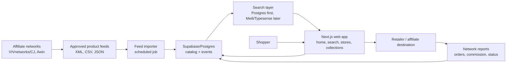
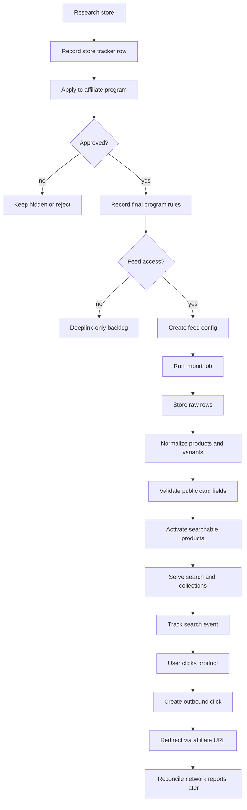
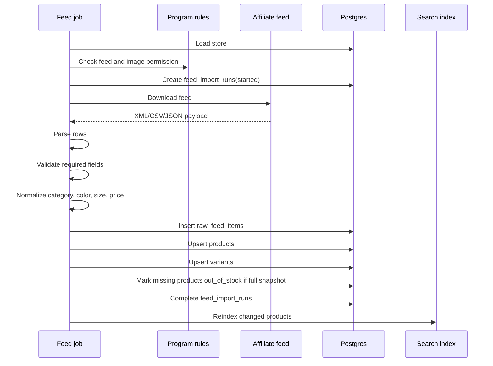
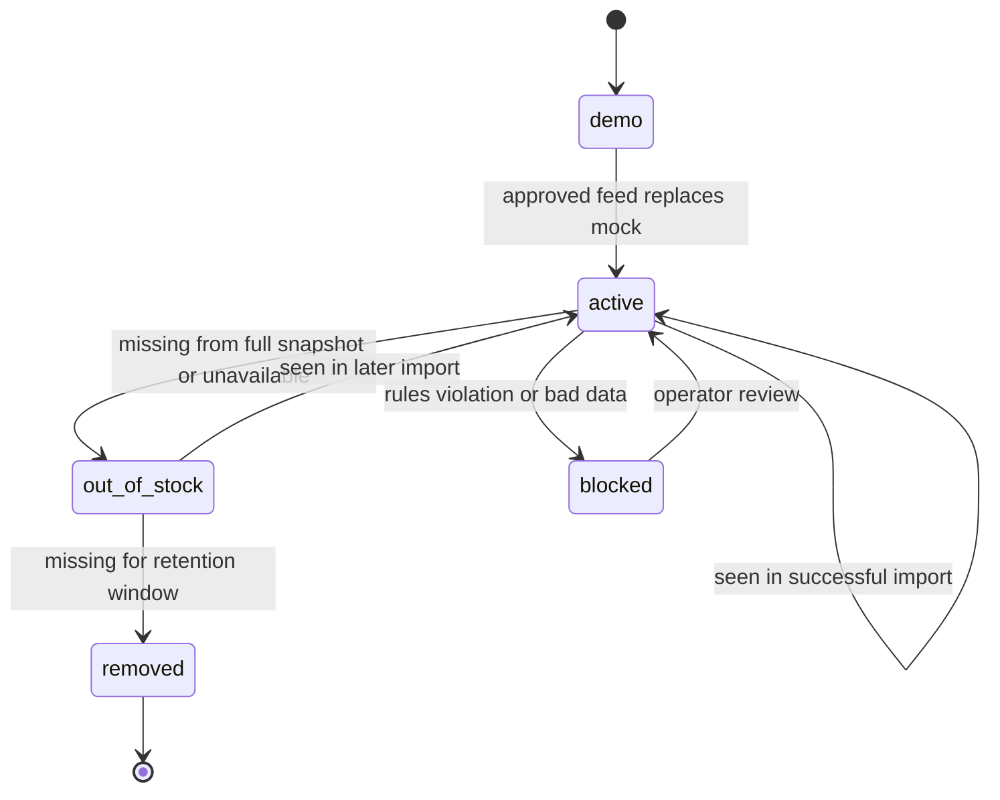
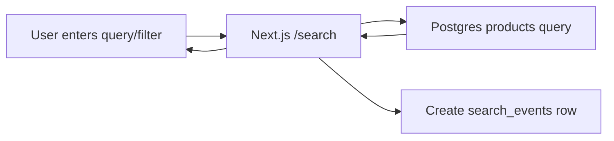
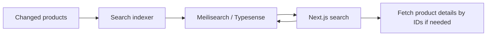
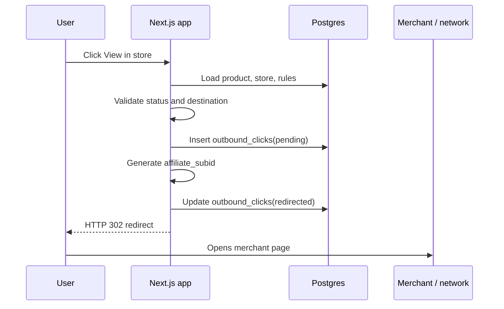

# Data Workflow

Prepared: 2026-07-23

This document describes the end-to-end data workflow for the fashion discovery
affiliate MVP: from affiliate program approval and product feed import to
search, public product cards, outbound affiliate clicks, analytics, and later
scale stages.

Related documents:

- `mvp_prd.md`
- `feed_import_spec.md`
- `clickout_tracking_spec.md`
- `../sql/001_pre_affiliate_schema.sql`
- `../data/store_tracker.csv`
- `../data/mock_products.csv`

## 1. Product Data Goal

The product is a visual fashion discovery site for Lithuanian shoppers. The
site should help users search and browse products by vibe, category, color,
size, price, and store, then click out to the official retailer through an
approved affiliate link.

The data system must prove four things:

1. Approved product feeds can be imported safely.
2. Products can be normalized into one searchable catalog.
3. Search and collection pages can generate outbound clicks.
4. Clicks can later be reconciled with affiliate network revenue reports.

The MVP is not a scraper, marketplace, checkout system, or coupon engine.

## 2. Data Principles

- Use approved affiliate feeds or explicit partner feeds only.
- Do not scrape retailer websites for catalog data.
- Keep raw feed rows for debugging and audit.
- Normalize product data into a common model without losing source payloads.
- Treat every store as hidden until feed permission and program rules are
  verified.
- Do not store raw IP addresses.
- Do not put PII into affiliate subids.
- Do not require login for browsing; anonymous traffic should stay anonymous.
- Do not proxy merchant images unless feed rules and cost controls allow it.
- Make every import idempotent.
- Never let a failed import mark products out of stock.
- Cache public catalog reads aggressively before scaling paid traffic.

## 3. System Context



## 4. Main Data Domains

| Domain | Purpose | Primary tables/files |
|---|---|---|
| Store registry | Which stores exist and whether they can be public | `stores`, `store_tracker.csv` |
| Program rules | Commission, cookie, feed, deeplink, traffic restrictions | `affiliate_program_rules` |
| Feed operations | Import run status, counts, errors, feed freshness | `feed_import_runs` |
| Raw source data | Audit/debug source rows | `raw_feed_items` |
| Catalog | Normalized product cards and variants | `products`, `product_variants` |
| Search metadata | Optional embeddings or style metadata | `product_embeddings` |
| User behavior | Search and filter events | `search_events` |
| Affiliate clickout | Outbound redirect and subid tracking | `outbound_clicks` |
| Demo data | Synthetic products before approval | `mock_products.csv` |

## 5. MVP Data States

### 5.1 Store Status

The store moves through this lifecycle:

```text
target
  -> applied
  -> approved_deeplink
  -> approved_feed
  -> live
```

Exceptional states:

```text
rejected
paused
blocked
```

Rules:

- `target`: research only, not public as a live source.
- `applied`: application sent, no live products.
- `approved_deeplink`: product links may be possible, but full feed may still
  be unavailable.
- `approved_feed`: store can enter feed import workflow.
- `live`: store can be shown in public product discovery pages.
- `paused` or `blocked`: clickouts and public listing should stop.

Current first-wave stores:

- Reserved LT
- Sinsay LT
- Sizeer LT
- MODIVO LT
- Cropp LT
- ABOUT YOU LT

Monitoring-only:

- Factcool LT, because the official LT site currently states sales were suspended from 2025-03-06.

## 6. End-to-End Workflow Overview



## 7. Workflow 1: Store Onboarding

Purpose: ensure each public store is legally and operationally allowed.

Inputs:

- Store name, market, website.
- Affiliate network and program URL.
- Public signals for product feeds.
- Commission and cookie information.
- Traffic restrictions.
- Feed/deeplink permission after approval.

Output:

- `stores` row.
- `affiliate_program_rules` row.
- Updated `store_tracker.csv` until a real admin UI exists.

Detailed steps:

1. Add target store to `store_tracker.csv`.
2. Verify affiliate network path.
3. Check whether product feeds are publicly mentioned.
4. Apply to affiliate program.
5. After approval, record final program rules:
   - commission text
   - cookie days
   - feed availability
   - deeplinking allowed
   - paid social allowed
   - brand SEM allowed or forbidden
   - coupon/cashback/content restrictions
6. Insert or update `stores`.
7. Insert or update `affiliate_program_rules`.
8. Only then allow a feed configuration to be created.

Acceptance criteria:

- Store has a unique slug.
- Store has a known affiliate network.
- Store has final rules recorded after approval.
- Store is not public until permission is confirmed.

## 8. Workflow 2: Feed Configuration

Purpose: define how one approved feed should be imported.

Feed config should include:

| Field | Example | Notes |
|---|---|---|
| `store_slug` | `reserved_lt` | Maps to `stores.slug` |
| `source_type` | `affiliate_feed` | Not scraper |
| `source_format` | `xml` | `xml`, `csv`, `tsv`, `json` |
| `source_url` | network feed URL | Credentials stay in env/secrets |
| `is_full_snapshot` | `true` | Controls out-of-stock logic |
| category map | `reserved_v1` | Internal mapping version |
| image policy | `feed_image_allowed` | Must match program rules |
| deeplink policy | `direct_affiliate_url` | Must match program rules |
| schedule | `daily` | Hourly only after need |

Storage:

- Do not commit live feed URLs with credentials.
- Put credentials in deployment secrets.
- Store non-secret metadata in database or config.

## 9. Workflow 3: Feed Import Job

Purpose: download, parse, normalize, and upsert a feed safely.



Detailed stages:

1. Load store and rules.
2. Abort if store is not approved for feed usage.
3. Create `feed_import_runs` with `status = started`.
4. Download feed into temporary storage.
5. Compute feed-level hash.
6. If unchanged, mark run completed with unchanged counts.
7. Parse rows with strict format-specific parser.
8. Validate minimum fields.
9. Normalize canonical fields.
10. Compute `raw_hash` and `content_hash`.
11. Insert `raw_feed_items`.
12. Upsert `products` by `store_id + external_product_id`.
13. Upsert variants when variant/size data exists.
14. For full snapshots, mark products not seen as out of stock.
15. Queue changed products for search reindexing/enrichment.
16. Complete run with counts and warnings.

Failure rules:

- Download failure: run fails, products unchanged.
- Parse failure: run fails, products unchanged.
- Too many invalid rows: run fails, products unchanged.
- Bad row: row is marked invalid; import continues.
- Failed run never marks missing products out of stock.

## 10. Workflow 4: Product Normalization

Purpose: make products from different stores searchable in one catalog.

Canonical product:

| Source concept | Canonical field |
|---|---|
| merchant product ID | `external_product_id` |
| product name | `title` |
| merchant category path | `merchant_category` |
| internal category | `normalized_category` |
| department/audience | `gender` |
| displayed color | `color_label` |
| filter color | `normalized_color` |
| current price | `price` |
| discount price | `sale_price` |
| previous price | `old_price` |
| product page | `product_url` |
| tracked link | `affiliate_url` |
| image | `image_url` |
| stock | `availability`, `in_stock`, `status` |

Normalization examples:

| Input | Output |
|---|---|
| `Women > Shoes > Trainers` | category `sneakers`, gender `woman` |
| `Black / Noir / Juoda` | normalized color `black` |
| `EU 42` | normalized size `eu_42` |
| `Out of stock` | `in_stock = false`, status `out_of_stock` |

Do not overwrite source values. Keep source values in raw payload and
merchant-specific columns for debugging.

## 11. Workflow 5: Product Lifecycle



Rules:

- `demo`: synthetic data only.
- `active`: can appear in public catalog and search.
- `out_of_stock`: hidden from default search, may appear in internal reports.
- `removed`: old item retained for history but not public.
- `blocked`: operator or validation blocked item.

Suggested retention:

- Keep active products indefinitely while feed keeps seeing them.
- Keep out-of-stock products for 30-90 days.
- Keep raw feed rows for 30-90 days in MVP, longer only if cheap storage is used.
- Keep clickout events for at least affiliate reconciliation window.

## 12. Workflow 6: Search Read Path

MVP search:



MVP approach:

- Use Postgres filters first.
- Query active products only.
- Filter by store, category, color, gender, price, availability.
- Start with simple text matching across title, brand, category, tags.
- Record search events after result count is known.

Later search approach:



When to move beyond Postgres:

- 100k+ active products.
- Autocomplete is needed.
- Facets become slow.
- Relevance needs typo tolerance and synonyms.
- Product discovery needs more vibe/style ranking.

Cost guardrails:

- Do not use Algolia early unless budget allows it.
- Debounce autocomplete.
- Cache common collection pages.
- Do not search on every keystroke without limits.

## 13. Workflow 7: Public Page Data

Page types:

| Page | Data source | Notes |
|---|---|---|
| Home | static/editorial + selected products | Cache aggressively |
| Search | products + filters | MVP dynamic, later cached by popular params |
| Store page | store + products | Static/ISR candidate |
| Collection page | normalized category/style query | SEO + paid landing page candidate |
| Data sources | store/rule summary | Trust page |
| Out route | product + affiliate rules | Must stay server-side |

Public product card fields:

- image
- title
- store name
- brand
- price/currency
- sale/old price when available
- category or style tags
- availability
- affiliate disclosure context
- clickout link to `/out/:productId`

Do not expose:

- raw affiliate feed URL
- feed credentials
- internal validation errors
- raw IP
- internal affiliate subid mapping

## 14. Workflow 8: Search Events

Purpose: understand user intent and connect search to clickout.

Event creation:

1. User searches or changes filters.
2. Backend normalizes query and filters.
3. Backend computes result count.
4. Backend inserts `search_events`.
5. Frontend receives products and optional `search_event_id`.
6. Product clickout includes `search_event_id`.

Data fields:

- `session_id`
- `anonymous_user_id`
- `query_text`
- `normalized_query`
- `filters`
- `sort_key`
- `result_count`
- `source_page`
- `referrer_url`
- `user_agent`
- `ip_hash`

Privacy:

- Do not store email in search events.
- Hash IP with private salt only if abuse prevention needs it.
- Consider truncating or dropping user agent later.
- Keep analytics event schema stable.

## 15. Workflow 9: Outbound Clickout

Purpose: send users to stores safely and generate affiliate attribution.



Validation:

- Product exists.
- Product status is active.
- Store is live.
- Store affiliate rules allow clickout.
- Destination URL is HTTPS.
- Destination host is allowed.
- Destination is not checkout/cart/admin.

Destination priority:

1. Variant-level `affiliate_url`.
2. Product-level `affiliate_url`.
3. Approved deeplink template + product URL.
4. Product URL only if direct tracking is explicitly allowed.

Subid:

- Use opaque internal ID, for example `fa_<short_click_id>`.
- Do not include email, query text, IP, or user identity.
- Store mapping internally in `outbound_clicks`.

## 16. Workflow 10: Affiliate Report Reconciliation

Purpose: connect network-reported orders/commission to our click data.

MVP can start manual. Later add table(s), for example:

- `affiliate_report_import_runs`
- `affiliate_report_rows`
- `affiliate_conversions`

Manual MVP workflow:

1. Export report from affiliate network.
2. Include date range, store, click/subid, order status, commission.
3. Match network subid to `outbound_clicks.affiliate_subid`.
4. Compute EPC, conversion rate, approval rate.
5. Update store/category performance dashboard manually or via SQL view.

Metrics:

| Metric | Formula |
|---|---|
| Clicks | count of `outbound_clicks` |
| Approved orders | network approved conversions |
| Conversion rate | approved orders / clicks |
| EPC | commission / clicks |
| Approval rate | approved orders / tracked orders |
| Revenue per session | commission / sessions |

Important:

- Affiliate networks may delay reporting by days.
- Orders can be pending, rejected, cancelled, or approved.
- Do not optimize stores only on raw clicks; use EPC after enough data exists.

## 17. Workflow 11: Analytics And Dashboards

Core product metrics:

- sessions
- searches
- zero-result searches
- filter usage
- product impressions
- outbound clicks
- search-to-click CTR
- store CTR
- category CTR
- clickout error rate

Feed health metrics:

- latest successful run per store
- import success rate
- invalid row rate
- missing image rate
- duplicate rate
- products inserted/updated/unchanged
- products out of stock
- products removed

Affiliate metrics:

- clicks by store
- clicks by source page
- clicks by query/category
- EPC after report import
- conversion rate after report import
- commission by store

Dashboard phases:

1. MVP: SQL queries/manual dashboard.
2. Early traffic: simple admin page or Supabase dashboard.
3. Scale: warehouse or analytics export if needed.

## 18. Workflow 12: Error Handling And Alerts

Feed import alerts:

- feed download failed
- parse failed
- zero valid public products
- invalid row rate above 30 percent
- missing image rate above 10 percent
- price parse error above 2 percent
- store has no successful import in 24-48 hours

Search alerts:

- zero-result rate spike
- search response time spike
- external search index unavailable

Clickout alerts:

- blocked/failed redirect rate above 1 percent
- unknown destination host detected
- product missing affiliate URL
- paused store receiving clicks

Security/privacy alerts:

- unexpected raw IP logging
- affiliate URL contains PII
- public API exposes hidden products
- feed credentials appear in logs

## 19. Workflow 13: Data Retention

Suggested MVP retention:

| Data | Retention | Notes |
|---|---:|---|
| Products | indefinite while active | Needed for catalog |
| Out-of-stock products | 30-90 days | Keep for reactivation/history |
| Raw feed rows | 30-90 days | Move snapshots to R2 later |
| Feed import runs | 12 months | Cheap and useful |
| Search events | 6-12 months | Aggregate later |
| Outbound clicks | 12-24 months | Needed for affiliate reconciliation |
| User accounts | until deletion request | Only after accounts exist |
| Logs | 7-30 days | Avoid storing PII |
| Affiliate reports | 24+ months | Accounting/revenue support |

Cost controls:

- Archive raw feed snapshots to Cloudflare R2.
- Keep detailed logs short-lived.
- Aggregate old search events by day/query/category.
- Do not store product image binaries unless required.

## 20. Workflow 14: Scaling By Traffic Stage

### Development / Pre-Affiliate

Data sources:

- `mock_products.csv`
- `store_tracker.csv`
- legal/trust docs

Stack:

- Next.js local/Vercel
- CSV mock products
- SQL schema ready
- no live merchant data

Goal:

- Look credible for affiliate applications.
- Prove demo search and legal positioning.

### First Approved Feed

Data sources:

- one approved affiliate feed
- final affiliate program rules

Stack:

- Supabase Postgres
- scheduled import
- Postgres search
- `/out/:productId`

Goal:

- Import one feed end to end.
- Re-import without duplicates.
- Track clickouts.

### 1k Users/Day

Expected:

- 90k-150k pageviews/month depending on sessions.
- Postgres search still acceptable.
- Daily feed imports enough for most stores.

Focus:

- cache public pages
- avoid image proxy
- record only key analytics events
- monitor clickout errors

### 10k Users/Day

Expected:

- 900k-1.5M pageviews/month.
- Product count may be 100k+.
- Search relevance and speed become important.

Changes:

- add Meilisearch/Typesense if Postgres is slow
- improve indexes
- batch click/event writes if needed
- cache collection/store pages
- use R2 for feed snapshots

### 100k Users/Day

Expected:

- 9M-15M pageviews/month.
- Search, analytics, and bandwidth become major cost drivers.

Changes:

- Cloudflare-heavy CDN strategy
- separate search cluster
- separate import worker
- batched analytics/event writes
- sampled product analytics/session replay
- aggregate old event data
- strict spend caps on SaaS tools

Avoid:

- Algolia autocomplete without budget controls
- Vercel image proxy for all merchant images
- mandatory anonymous auth for every visitor
- writing every impression synchronously to primary Postgres

## 21. Future Data Workflows

### Saved Boards / Accounts

Add only after traffic validation.

Possible tables:

- `user_profiles`
- `saved_boards`
- `saved_board_items`

Rules:

- Browsing stays anonymous.
- Login is optional.
- Saved items use product IDs, not copied merchant data.
- Deletion request removes user-owned data.

### Subscription Features

Possible paid features:

- saved boards
- advanced style filters
- AI stylist
- 3D try-on

Rules:

- Put subscription logic outside MVP feed import.
- Do not mix billing provider IDs into public analytics.
- Keep paid feature events separate from affiliate click events.

### AI / Style Enrichment

Potential sources:

- product title
- description
- category
- image alt/style text

Workflow:

1. Import product.
2. Detect changed `content_hash`.
3. Queue enrichment.
4. Generate tags/embeddings.
5. Store in `product_embeddings` or later vector column.
6. Reindex search.

Guardrails:

- Batch offline.
- Only enrich changed products.
- Cap daily spend.
- Do not send unauthorized images if rules forbid it.

## 22. Implementation Backlog

### Phase A: Current Mock MVP

- Keep `mock_products.csv` as demo-only source.
- Keep demo source labels clear.
- Add search event skeleton.
- Add `/out/:productId` skeleton with safe demo behavior.

### Phase B: Database Activation

- Apply `001_pre_affiliate_schema.sql` to Supabase.
- Seed first-wave stores from `store_tracker.csv`.
- Seed affiliate rules after approval.
- Replace CSV product reads with database reads.

### Phase C: First Feed Import

- Build feed config format.
- Build importer for one XML feed.
- Insert `feed_import_runs`.
- Insert `raw_feed_items`.
- Upsert `products`.
- Upsert `product_variants`.
- Add import summary logs.

### Phase D: Search And Clickout

- Query active products from database.
- Save `search_events`.
- Include `search_event_id` in clickout links.
- Implement `/out/:productId`.
- Validate affiliate destinations.
- Save `outbound_clicks`.

### Phase E: Operator Visibility

- Create simple import status view.
- Create clickout metrics query.
- Create top queries query.
- Create store freshness query.
- Add alerts for feed failure and clickout failure.

## 23. Acceptance Checklist

The data workflow is MVP-ready when:

- No unapproved store is public as a live source.
- At least one approved feed imports successfully.
- Re-importing the same feed does not duplicate products.
- Products missing from a failed import are not marked out of stock.
- Product cards show only valid public fields.
- Search returns active products only.
- Search events record query, filters, and result count.
- Clickout creates an `outbound_clicks` row before redirect.
- Clickout destination is validated.
- Affiliate subid contains no PII.
- Feed errors are visible to the operator.
- Legal/data source pages explain affiliate data usage.
- Analytics can answer which store/query/category generated clicks.

## 24. Recommended First Production Stack

For the first real launch:

| Layer | Recommendation |
|---|---|
| Web | Next.js on Vercel Pro |
| Database | Supabase Postgres Pro |
| Search | Postgres filters/text search |
| Feed jobs | GitHub Actions or Supabase scheduled job |
| Assets/feed snapshots | none at first, Cloudflare R2 later |
| Analytics | `search_events`, `outbound_clicks`, GA4/PostHog limited |
| Monitoring | Sentry + Better Stack/Uptime monitor |
| Email | Google Workspace + Resend |

Revisit the stack when:

- active products exceed 100k
- search response time degrades
- traffic reaches 10k users/day
- analytics cost grows faster than revenue
- outbound clicks justify deeper affiliate reconciliation
