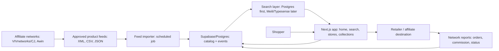
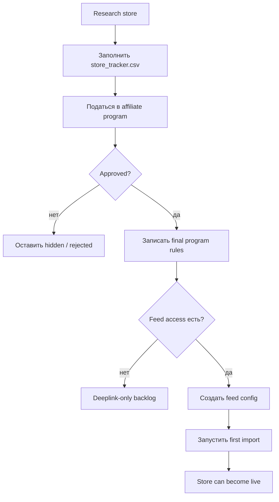
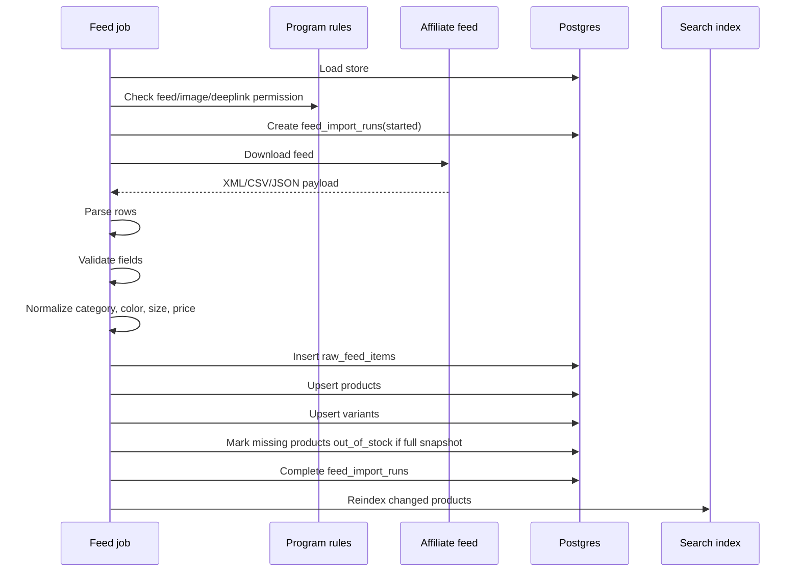
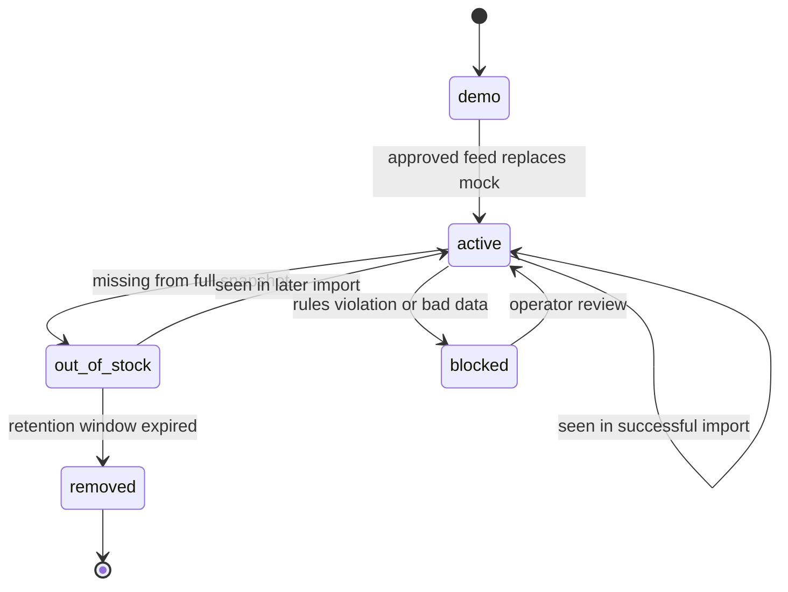
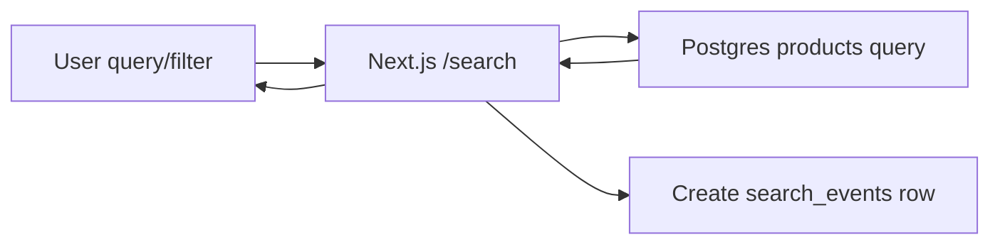
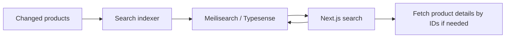
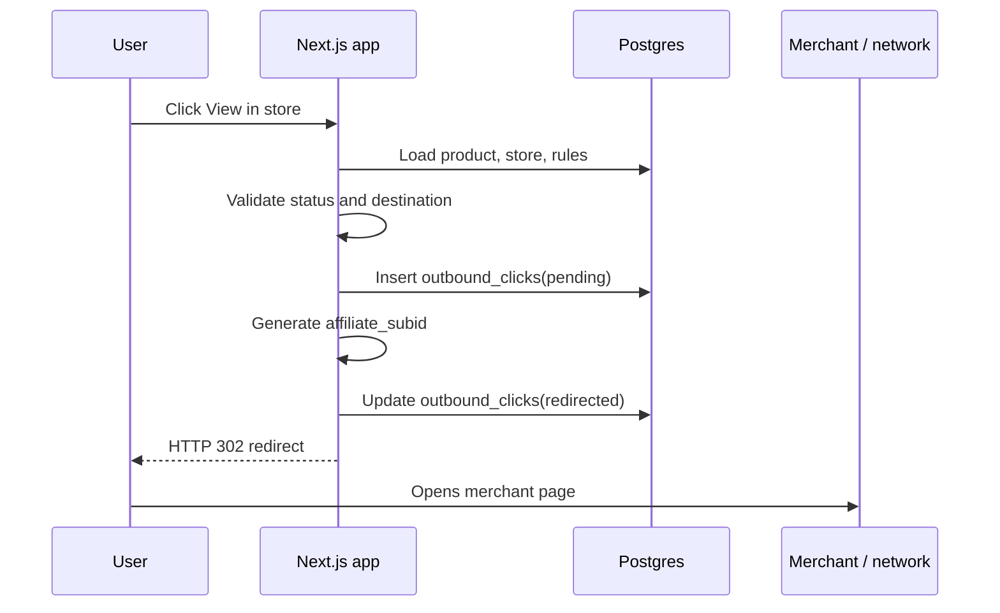

# Workflow данных проекта

Подготовлено: 2026-07-23

Этот документ описывает полный workflow данных для Fashion Aggregator: от
affiliate approval и продуктовых фидов до поиска, карточек товаров, clickout,
аналитики, reconciliation с affiliate networks и масштабирования на
1k / 10k / 100k пользователей в день.

Связанные документы:

- `mvp_prd.md`
- `feed_import_spec.md`
- `clickout_tracking_spec.md`
- `data_workflow.md`
- `data_workflow_ru.html`
- `../sql/001_pre_affiliate_schema.sql`
- `../data/store_tracker.csv`
- `../data/mock_products.csv`

## 1. Цель данных

Проект должен стать визуальным fashion discovery сайтом для Литвы. Пользователь
ищет товары не по одному магазину, а по vibe, категории, цвету, размеру, цене,
бренду и store, затем переходит на официальный сайт магазина через approved
affiliate link.

Система данных должна доказать четыре вещи:

1. Approved product feeds можно безопасно импортировать.
2. Товары из разных магазинов можно привести к единой catalog model.
3. Search и collection pages могут генерировать outbound clicks.
4. Clicks можно связать с affiliate reports и комиссией.

MVP не является:

- marketplace;
- scraper;
- checkout system;
- coupon site;
- official retailer partner.

Покупка всегда происходит на стороне официального магазина.

## 2. Принципы работы с данными

Что делаем:

- Используем только approved affiliate feeds или explicit partner permission.
- Не скрапим сайты магазинов.
- Храним raw feed rows для audit/debug.
- Нормализуем продукты в общую модель, не теряя original payload.
- Не показываем store как live source до подтвержденного permission.
- Не храним raw IP.
- Не кладем PII в affiliate subid.
- Не требуем login для обычного browsing.
- Не проксируем merchant images через себя, пока это не разрешено правилами и
  не оправдано по cost.
- Делаем feed import идемпотентным.
- Failed import не должен менять продукты на `out_of_stock`.
- Публичные catalog reads кешируем перед paid traffic и ростом трафика.

Главный смысл: сначала legal/feed-safe каталог, потом scale и умные фичи.

## 3. Общая архитектура данных



Пользователь видит только нормализованный каталог. Raw feed, affiliate
credentials, internal validation errors и subid mapping остаются внутри системы.

## 4. Домены данных

| Домен | Зачем нужен | Таблицы / файлы |
|---|---|---|
| Store registry | Какие stores существуют и можно ли показывать их публично | `stores`, `store_tracker.csv` |
| Affiliate rules | Комиссия, cookie, feed, deeplink, SEM и traffic restrictions | `affiliate_program_rules` |
| Feed operations | Статус импорта, ошибки, counts, freshness | `feed_import_runs` |
| Raw source data | Оригинальные строки фида для audit/debug | `raw_feed_items` |
| Catalog | Нормализованные карточки и варианты | `products`, `product_variants` |
| Search metadata | Embeddings/style metadata later | `product_embeddings` |
| User behavior | Поисковые запросы, фильтры, result count | `search_events` |
| Affiliate clickout | Redirect и affiliate attribution | `outbound_clicks` |
| Demo data | Синтетические товары до approval | `mock_products.csv` |

## 5. Workflow магазинов

Магазин нельзя сразу показывать как live source. Сначала нужно подтвердить:

- affiliate program access;
- final program rules;
- product feed availability;
- deeplinking permission;
- image usage permission;
- paid traffic restrictions;
- brand SEM rules;
- coupon/cashback/content restrictions.

Lifecycle магазина:

```text
target
  -> applied
  -> approved_deeplink
  -> approved_feed
  -> live
```

Исключительные состояния:

```text
rejected
paused
blocked
```

Правила:

| Статус | Что означает | Можно ли показывать товары |
|---|---|---|
| `target` | Магазин интересен, permission нет | Нет |
| `applied` | Заявка отправлена | Нет |
| `approved_deeplink` | Есть deeplink/click permission, feed может быть не готов | Ограниченно |
| `approved_feed` | Есть разрешение и доступ к product feed | Да, после успешного import |
| `paused` | Временная пауза | Нет |
| `blocked` | Legal/data/rules issue | Нет |

Текущие first-wave stores:

- Reserved LT;
- Sinsay LT;
- Sizeer LT;
- MODIVO LT;
- Cropp LT;
- ABOUT YOU LT.

Monitoring-only:

- Factcool LT, потому что официальный LT-сайт сейчас сообщает, что продажи были остановлены с 2025-03-06.

## 6. Store onboarding flow



Acceptance criteria:

- Store имеет уникальный slug.
- Store имеет известный affiliate network.
- Final rules сохранены после approval.
- Store не public, пока permission не подтвержден.
- Feed config создан только после feed access.

## 7. Feed config

Feed config описывает, как импортировать конкретный approved feed.

| Поле | Пример | Комментарий |
|---|---|---|
| `store_slug` | `reserved_lt` | Связь с `stores.slug` |
| `source_type` | `affiliate_feed` | Не scraper |
| `source_format` | `xml` | XML, CSV, TSV или JSON |
| `source_url` | network feed URL | Credentials только в env/secrets |
| `is_full_snapshot` | `true` | Контролирует out-of-stock logic |
| `category_map` | `reserved_v1` | Версия нормализации категорий |
| `image_policy` | `feed_image_allowed` | Должно совпадать с program rules |
| `deeplink_policy` | `direct_affiliate_url` | Должно совпадать с program rules |
| `schedule` | `daily` | Hourly только после реальной необходимости |

Правила хранения:

- Live feed URLs с credentials не коммитить.
- Secrets хранить в Vercel/Supabase/GitHub secrets.
- В database/config хранить только non-secret metadata.

## 8. Workflow импорта фида



Подробные шаги:

1. Load store and affiliate rules.
2. Abort, если store не approved для feed usage.
3. Создать `feed_import_runs` со статусом `started`.
4. Скачать feed во временное storage.
5. Посчитать feed-level hash.
6. Если feed не изменился, завершить run с unchanged counts.
7. Распарсить rows строго по формату.
8. Провалидировать minimum required fields.
9. Нормализовать canonical fields.
10. Посчитать `raw_hash` и `content_hash`.
11. Insert `raw_feed_items`.
12. Upsert `products` по `store_id + external_product_id`.
13. Upsert `product_variants`, если есть variant/size data.
14. Для full snapshot отметить unseen products как `out_of_stock`.
15. Queue changed products для search reindex/enrichment.
16. Complete run with counts, warnings, notes.

Failure rules:

- Download failure: run fails, products unchanged.
- Parse failure: run fails, products unchanged.
- Too many invalid rows: run fails, products unchanged.
- Bad row: row marked invalid, import continues.
- Failed run never marks missing products as `out_of_stock`.

## 9. Валидация feed rows

Minimum public card fields:

- `title`;
- `store_id`;
- `product_url` или `affiliate_url`;
- `image_url`;
- `price`;
- `currency`;
- `availability` или `in_stock`.

Invalid/skipped rules:

| Проблема | Что делать |
|---|---|
| Нет `external_product_id` | Invalid row |
| Нет `title` | Invalid row |
| Нет price/currency | Invalid for public listing |
| Нет image | Keep raw row, skip public card |
| Malformed URL | Invalid row |
| Unknown availability | Conservative: out_of_stock or skipped |
| Destination not allowed | Block clickout |

Suggested thresholds:

- Warning: invalid rows > 5%.
- Failure: invalid rows > 30%.
- Failure: zero valid public products from previously working feed.

## 10. Нормализация товара

Задача нормализации: сохранить source values и одновременно собрать единый
catalog model.

| Source concept | Canonical field | Зачем |
|---|---|---|
| Merchant product ID | `external_product_id` | Уникальность товара внутри магазина |
| Product name | `title` | Карточка и поиск |
| Category path | `merchant_category`, `normalized_category` | Debug + filters/SEO |
| Audience / department | `gender` | WOMAN / MAN / KIDS |
| Color | `color_label`, `normalized_color` | Display + filter |
| Size | `size_label`, `normalized_size` | Filter |
| Price | `price`, `sale_price`, `old_price` | Display, sale, sorting |
| Product URL | `product_url` | Original merchant page |
| Affiliate URL | `affiliate_url` | Tracked clickout |
| Image URL | `image_url` | Product card |
| Stock | `availability`, `in_stock`, `status` | Hide dead products |

Примеры:

| Raw input | Normalized output |
|---|---|
| `Women > Shoes > Trainers` | `gender = woman`, `normalized_category = sneakers` |
| `Black / Noir / Juoda` | `normalized_color = black` |
| `EU 42` | `normalized_size = eu_42` |
| `Extra Small` | `normalized_size = xs` |
| `One Size` | `normalized_size = one_size` |
| `Out of stock` | `in_stock = false`, `status = out_of_stock` |

Не надо смешивать shoe sizes и clothing sizes в одну шкалу.

## 11. Lifecycle товара



| Статус | Показывать в поиске? | Комментарий |
|---|---|---|
| `demo` | Только demo mode | Синтетические товары, не live merchant products |
| `active` | Да | Основной публичный статус |
| `out_of_stock` | По умолчанию нет | Хранить для истории/reactivation |
| `removed` | Нет | Старый товар после retention |
| `blocked` | Нет | Legal/rules/data issue |

Suggested retention:

- Active products: пока feed продолжает их видеть.
- Out-of-stock products: 30-90 дней.
- Raw feed rows: 30-90 дней.
- Feed import runs: 12 месяцев.
- Search events: 6-12 месяцев.
- Outbound clicks: 12-24 месяца.
- Logs: 7-30 дней, без PII.

## 12. Search workflow

MVP search:



MVP rules:

- Query only `active` products.
- Filters: store, category, color, gender, price, availability.
- Text search: title, brand, category, tags.
- Search event создается после result count.
- Popular collection/store pages можно кешировать.

Later search:



Когда переходить с Postgres на search engine:

- 100k+ active products.
- Facets стали медленными.
- Нужны typo tolerance и synonyms.
- Нужен autocomplete.
- Нужен better vibe/style ranking.

Cost guardrails:

- Не включать Algolia рано без budget cap.
- Debounce autocomplete.
- Не искать на каждый символ без лимитов.
- Cache common collection pages.

## 13. Данные публичных страниц

| Page | Data source | Rule |
|---|---|---|
| Home | Editorial blocks + selected products | Cache aggressively |
| Search | Products + filters | Dynamic first, later cache popular params |
| Store page | Store + products | Only approved/live stores |
| Collection page | Category/style query | SEO and paid landing page |
| Data sources | Store/rule summary | Trust page |
| `/out/:productId` | Product + affiliate rules | Server-side validation only |

Public product card fields:

- image;
- title;
- store name;
- brand;
- price/currency;
- sale/old price;
- category/style tags;
- availability;
- affiliate disclosure context;
- clickout link to `/out/:productId`.

Do not expose:

- raw affiliate feed URL;
- feed credentials;
- internal validation errors;
- raw IP;
- internal affiliate subid mapping.

## 14. Search events

Purpose: понять user intent и связать search с clickout.

Flow:

1. User searches or changes filters.
2. Backend normalizes query and filters.
3. Backend computes result count.
4. Backend inserts `search_events`.
5. Frontend receives products and optional `search_event_id`.
6. Product clickout includes `search_event_id`.

Data fields:

- `session_id`;
- `anonymous_user_id`;
- `query_text`;
- `normalized_query`;
- `filters`;
- `sort_key`;
- `result_count`;
- `source_page`;
- `referrer_url`;
- `user_agent`;
- `ip_hash`.

Privacy rules:

- Не хранить email в search events.
- IP hash только с private salt и только если реально нужно.
- Не логировать search params с PII.
- Event schema держать стабильной.

## 15. Clickout workflow



Validation:

- Product exists.
- Product status is `active`.
- Store is `live`.
- Store affiliate rules allow clickout.
- Destination URL is HTTPS.
- Destination host is allowlisted.
- Destination is not checkout/cart/admin.

Destination priority:

1. Variant-level `affiliate_url`.
2. Product-level `affiliate_url`.
3. Approved deeplink template + product URL.
4. Product URL only if direct tracking is explicitly allowed.

Affiliate subid:

```text
fa_<short_click_id>
```

Subid rules:

- opaque internal ID only;
- no email;
- no query text;
- no IP;
- no raw session data;
- mapping stays in `outbound_clicks`.

## 16. Affiliate report reconciliation

Affiliate networks report orders/commission with delay. MVP can start with
manual reconciliation.

Manual workflow:

1. Export report from affiliate network.
2. Include date range, store, click/subid, order status, commission.
3. Match network subid to `outbound_clicks.affiliate_subid`.
4. Compute EPC, conversion rate, approval rate.
5. Compare store/category/query performance.

Future tables:

- `affiliate_report_import_runs`;
- `affiliate_report_rows`;
- `affiliate_conversions`.

Metrics:

| Metric | Formula |
|---|---|
| Clicks | count of `outbound_clicks` |
| Approved orders | network approved conversions |
| Conversion rate | approved orders / clicks |
| EPC | commission / clicks |
| Approval rate | approved orders / tracked orders |
| Revenue per session | commission / sessions |

Important:

- Orders can be pending, rejected, cancelled, approved.
- Reporting can lag by days or weeks.
- Optimize stores by EPC/revenue, not by raw clicks only.

## 17. Analytics и dashboards

Core product metrics:

- sessions;
- searches;
- zero-result searches;
- filter usage;
- product impressions;
- outbound clicks;
- search-to-click CTR;
- store CTR;
- category CTR;
- clickout error rate.

Feed health metrics:

- latest successful run per store;
- import success rate;
- invalid row rate;
- missing image rate;
- duplicate rate;
- products inserted/updated/unchanged;
- products out of stock;
- products removed.

Affiliate metrics:

- clicks by store;
- clicks by source page;
- clicks by query/category;
- EPC after report import;
- conversion rate after report import;
- commission by store.

Dashboard phases:

1. MVP: SQL queries/manual dashboard.
2. Early traffic: simple admin page or Supabase dashboard.
3. Scale: warehouse/analytics export if needed.

## 18. Ошибки и алерты

Feed import alerts:

- feed download failed;
- parse failed;
- zero valid public products;
- invalid row rate > 30%;
- missing image rate > 10%;
- price parse error > 2%;
- store has no successful import in 24-48 hours.

Search alerts:

- zero-result rate spike;
- search response time spike;
- external search index unavailable.

Clickout alerts:

- blocked/failed redirect rate > 1%;
- unknown destination host detected;
- product missing affiliate URL;
- paused store receiving clicks.

Security/privacy alerts:

- raw IP appears in logs;
- affiliate URL contains PII;
- public API exposes hidden products;
- feed credentials appear in logs.

## 19. Retention данных

| Data | Retention | Notes |
|---|---:|---|
| Products | Пока active | Needed for catalog |
| Out-of-stock products | 30-90 days | Reactivation/history |
| Raw feed rows | 30-90 days | Move snapshots to R2 later |
| Feed import runs | 12 months | Useful for ops |
| Search events | 6-12 months | Aggregate later |
| Outbound clicks | 12-24 months | Affiliate reconciliation |
| User accounts | Until deletion request | Only after accounts exist |
| Logs | 7-30 days | Avoid PII |
| Affiliate reports | 24+ months | Accounting/revenue support |

Cost controls:

- Archive raw feed snapshots to Cloudflare R2.
- Keep detailed logs short-lived.
- Aggregate old search events by day/query/category.
- Do not store product image binaries unless required.

## 20. Масштабирование по фазам

### Development / pre-affiliate

Data sources:

- `mock_products.csv`;
- `store_tracker.csv`;
- legal/trust docs.

Stack:

- Next.js local/Vercel;
- CSV mock products;
- SQL schema ready;
- no live merchant data.

Goal:

- credible demo for affiliate applications;
- no unauthorized product data.

### First approved feed

Data sources:

- one approved affiliate feed;
- final affiliate program rules.

Stack:

- Supabase Postgres;
- scheduled import;
- Postgres search;
- `/out/:productId`.

Goal:

- import one feed end to end;
- re-import without duplicates;
- clickout tracking works.

### 1k users/day

Expected:

- примерно 90k-150k pageviews/month;
- Postgres search still acceptable;
- daily feed imports enough.

Focus:

- cache public pages;
- avoid image proxy;
- record only key analytics events;
- monitor clickout errors.

### 10k users/day

Expected:

- примерно 900k-1.5M pageviews/month;
- product count может стать 100k+;
- search relevance/speed становятся важными.

Changes:

- add Meilisearch/Typesense if Postgres is slow;
- improve DB indexes;
- batch click/event writes if needed;
- cache collection/store pages;
- use R2 for feed snapshots.

### 100k users/day

Expected:

- 9M-15M pageviews/month;
- search, analytics, bandwidth become major cost drivers.

Changes:

- Cloudflare-heavy CDN strategy;
- separate search cluster;
- separate import worker;
- batched analytics/event writes;
- sampled product analytics/session replay;
- aggregate old event data;
- strict SaaS spend caps.

Avoid:

- Algolia autocomplete without budget controls;
- Vercel image proxy for all merchant images;
- mandatory anonymous auth for every visitor;
- synchronous write of every impression into primary Postgres.

## 21. Будущие workflow

### Saved boards / accounts

Добавлять только после traffic validation.

Possible tables:

- `user_profiles`;
- `saved_boards`;
- `saved_board_items`.

Rules:

- Browsing stays anonymous.
- Login is optional.
- Saved items use product IDs, not copied merchant data.
- Deletion request removes user-owned data.

### Subscription features

Possible paid features:

- saved boards;
- advanced style filters;
- AI stylist;
- 3D try-on.

Rules:

- Subscription logic outside MVP feed import.
- Billing provider IDs не смешивать с public analytics.
- Paid feature events держать отдельно от affiliate click events.

### AI / style enrichment

Workflow:

1. Import product.
2. Detect changed `content_hash`.
3. Queue enrichment.
4. Generate tags/embeddings.
5. Store in `product_embeddings` or later vector column.
6. Reindex search.

Guardrails:

- Batch offline.
- Only enrich changed products.
- Daily spend cap.
- Do not send unauthorized images if rules forbid it.

## 22. Implementation backlog

### Phase A: Current mock MVP

- Keep `mock_products.csv` as demo-only source.
- Keep demo source labels clear.
- Add search event skeleton.
- Add `/out/:productId` skeleton with safe demo behavior.

### Phase B: Database activation

- Apply `001_pre_affiliate_schema.sql` to Supabase.
- Seed first-wave stores from `store_tracker.csv`.
- Seed affiliate rules after approval.
- Replace CSV product reads with database reads.

### Phase C: First feed import

- Build feed config format.
- Build importer for one XML feed.
- Insert `feed_import_runs`.
- Insert `raw_feed_items`.
- Upsert `products`.
- Upsert `product_variants`.
- Add import summary logs.

### Phase D: Search and clickout

- Query active products from database.
- Save `search_events`.
- Include `search_event_id` in clickout links.
- Implement `/out/:productId`.
- Validate affiliate destinations.
- Save `outbound_clicks`.

### Phase E: Operator visibility

- Create simple import status view.
- Create clickout metrics query.
- Create top queries query.
- Create store freshness query.
- Add alerts for feed failure and clickout failure.

## 23. Acceptance checklist

Workflow данных готов к MVP, когда:

- no unapproved store is public as a live source;
- at least one approved feed imports successfully;
- re-importing the same feed does not duplicate products;
- failed import does not mark active products out of stock;
- product cards show only valid public fields;
- search returns active products only;
- search events record query, filters, and result count;
- clickout creates an `outbound_clicks` row before redirect;
- clickout destination is validated;
- affiliate subid contains no PII;
- feed errors are visible to operator;
- legal/data source pages explain affiliate data usage;
- analytics can answer which store/query/category generated clicks.

## 24. Рекомендованный первый production stack

| Layer | Recommendation |
|---|---|
| Web | Next.js on Vercel Pro |
| Database | Supabase Postgres Pro |
| Search | Postgres filters/text search |
| Feed jobs | GitHub Actions or Supabase scheduled job |
| Assets/feed snapshots | none at first, Cloudflare R2 later |
| Analytics | `search_events`, `outbound_clicks`, GA4/PostHog limited |
| Monitoring | Sentry + Better Stack/Uptime monitor |
| Email | Google Workspace + Resend |

Revisit stack when:

- active products exceed 100k;
- search response time degrades;
- traffic reaches 10k users/day;
- analytics cost grows faster than affiliate revenue;
- outbound clicks justify deeper affiliate reconciliation.
